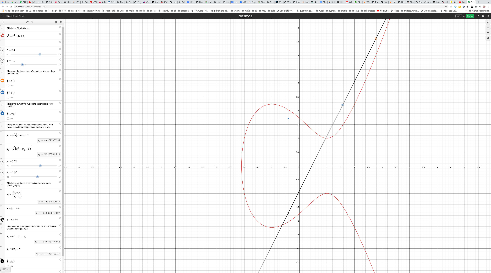

### Elliptic Curve Cryptography (EC)

The main motivation for using/developing EC, remember that we already have
algorithms that use the discrete logarithm problem. Well it turns out that with
EC we can have smaller operands but still the same amount of security. Remember
that the key lenghts don't always correspond to the actual level of security due
to various attacks available. So we need to increase the sizes to still get the
same level of actual security. But with greater key sizes the computations
become more compute intensive and less efficient (like more power on devices
and CPU time). 

We can do public key exchange, encryption, and digital signatures with EC.

The idea is to find another cyclic group where the discrete logarithm problem
is difficult, preferrably more difficult than the cyclic group of Zp^*.

Lets start with the following polynomial, which is a circle:
```
  x² + y² = r²
```
So we have a point on the circle `p(x, y)` and the radius is r.
```
0.707² + 0.707² = 1
```
Now, if we add cofficients to x and y we get an ellipse:
```
  ax² + by² = r²
```
The two examples above deal with real numbers.
For crypto we need to consider polynomials in Z_p.

### Definition
```
y² = x³ + ax + b mod p

We also need an imaginary point at infinity, where a,b ∈ Zp and 
4a³ + 27 b² != 0 mod p  (these curves cannot be used in crypto)
```

Without using mod p we can visualize this (this is not possible when using
the modulo operation, the visual collapses), for example:
```
y² = x³ - 3x + 3
```
You can try this out at https://www.desmos.com/calculator/ialhd71we3



And get the value of y then we square:
```
y² = x³ + ax + b
      ____________
y  = √ x³ + ax + b
```

Just to get a feel for this lets plug in x=1:
```
x = 1
y² = 1³ - 3*1 + 3
y² = 1 - 3 + 3
y² = -2    + 3
y² = 1
y  = √1
y  = +- 1
```
And if we look at the graph we can see that (1, 1) and (1, -1) are both valid
points on the curve. The `+-` shows the symmetry of the curve, the points are
reflected.

Now, we need a cyclic group for the descrete logarithm problem.
The set of `group elements` are the `points` on the curve and we need to be able
to compute with these elements, much like we computed with integers earlier.
This is the group operation and previously we used multiplication.

We need to be able to `add` points together which is the group operation.

### Group operation
This is the addition of points, the group elememts, on the curve.

So how do we add points:
```
P =  (point on the curve)
Q =  (point on the curve)

P + Q = ?
```
We can visualize this (again without mod p). Draw a line between from the first
point to the second and let it extend through the second point and continue. It
will intersect with the curve at some point when we do this. Now, remember we
mentioned that the curve is symmetric, so we reflect (multiple by -1?) which
gives as the point R. So R = P + Q. 
This is the definition of the group operation.

Now, think about the point P and what if we want to add the same point with
itself, like 1 + 1 = 2. We can't draw a line from the point to itself, there
will be no intersect point that we can reflect.

Now, there are two different cases we have to consider
```
1) Point addition (what was described above)
   R = P + Q

2) Point doubling
   For this we have to take the tagent and see where it intersects with the
   curve, and then reflect that point.
```

So that was a nice visual but how do we actually compute these points.
Well we have to compute the line between the two points and we know the two
points (just to make that clear):
```
P = (x₁, y₁)
Q = (x₂, y₂)

y = sx + m

Where s is the slope we can get by taking (for point addition):

    y₂ - y₁
s = -------- mod p
    x₂ - x₁ 

And for point doubling:
 
    3x₁² + a
s = -------- mod p
      2y₁
```

Now we need to find the intersection with the curve after finding the line.
```
E: y² = x³ + ax + b
l: y  = sx + m

l = E
(sx + m)²            = x³ + ax + b
(sx + m)(sx + m)     = x³ + ax + b

sx² + sxm + sxm + m² = x³ + ax + b
s²*x² + 2smx + m²    = x³ + ax + b
```
So we can see that we have an equation with degree 3 so we have 3 solutions,
x₁, x₂, and x₃.
```
x₁ is the x value of point P(x₁, y₁)
x₂ is the x value of point Q(x₂, y₂)
x₃ is the x value of the intersect point R(x₃, y₃)

x₃ = x² - x₁ - x₂ mod p
y₃ = x(x₁ - x₃) - y₁ mod p
```

```
 y₂ - y₁
 -------  mod p     -> (y₂ - y₁)(x₂ - x₁)⁻¹ mod p
 x₂ - x₁
```

To be a group we need to fulfill the requirements that the group operation
is closed, associative. 

There also has to be an identity element such that a + 1 = 1 + a = a. What is
this identity value of this group?  

So P + (some point) = P
It turns out that there is no point that we can calculate using the above steps
and get this 0/NUll point, instead one has been defined.
This is "point at infinity" which uses the symbol ó.
```
P + ó = P
```
The negative (opposite) of `P` is:
```
-P  of P(x, y) is -P = (x, -y)
```

### EC Discrete Logarithm Problem (EC-DLP)
Elliptic curve as a cyclic group (not all curves form a cyclic group, for
example:
```
E: y² = x³ +2x + 2 mod 17
```
For the group to be cyclic we need a generator/primitive element which can
generate points on the curve. An example of a generator/primitive element is:
```
Primitive Element P = (5, 1)    // (x, y)

       +------------------------------------------------+
       ↓                                                |
2P  = (5, 1) + (5, 1)  = (formula from above) = (6, 3)  |
3P  = 2P + P           = (formula from above) = (10, 6) |
                      ...                        +------+
                                                 ↓
18P = 17P + P          = (formula from above) = (5, 16)
```
Notice that for `18P` we have the same x coordinate, `5` as the primitive
element. And the `16` is the inverse mod p of 1:
```
-1 ≡ 16 mod 17

18P = (5, 16) = (5, -1)
```
And `(5, -1)` is then `-P`, the inverse of P.
```text
19P = 18P + P = (5, 16) + (5, 1)
```
But we have to check that the `y` coordinates are the inverse of each other.
```text
19P = 18P + P = (5, 16) + (5, 1)
              =   -p    + p      = ó the neutral element for the group.
```
The neutral element (or point of infinity) can be thought of as 1 in a
multiplicative group, or 0 in an additive group.
```text
20P = 19P + P = ó  + P           = P
```
So just like adding 0 an integer does not affect the integer.
```test
21P = 20P + P  = P   + P  = 2P     = (6, 3)
22P = 21P + P  = 2P  + P  = 3P     = (10, 6)
```
And notice that we are cycling through the group.

Notice that the order (number of elements in the group) are 19 in this case
```text
1P  = (5, 1)
2P  = (6, 3)
3P  = (10, 6)
4P  = (3, 1)
5P  = (9, 16)
6P  = (16, 13)
7P  = (0, 6)
8P  = (13, 7)
9P  = (7, 6)
10P = (7, 11)
11P = (13, 10)
12P = (0, 11)
13P = (16, 4)
14P = (9, 1)
15P = (3, 16)
16P = (10, 11)
17P = (6, 14)
18P = (5, 16)
19P = ó

20P = 2P
21P = 3P
23P = 4P
24P = 5P
```

Lets take a concrete example of point doubling, so we want to do 2P, or P + P:
```
Point P: (5, 1)

   y² = x³ + a*x + b mod p

E: y² = x³ + 2*x  + 2 mod 17

Lets start by getting x₃ (which is R(x₃, y₃))
x₃ = s² - x₁ - x₂ mod p

For this we need to calculate the slope using:

    3x₁² + a
s = -------- mod p
      2y₁

So we plug in the values:

     (3 * 5)² + 2
s = ------------- = (3*5²+2)(2*1)⁻¹ = (77)(2)⁻¹
       2 * 1       

s = (77)(2⁻¹) = (77 mod 17)(2⁻¹ mod 17)
s = (77)(2⁻¹) = (9)(2⁻¹ mod 17)
Now we have to find the modular inverse 2⁻¹ mod 17
Recall that 2⁻¹ mod 17 is asking for a number k such that 2k = 1 (mod 17)
{0, 1, 2, 3, 4, 5, 6, 7, 8, 9, 10, 11, 12, 13, 14, 15, 16}
2 * 0 mod 17 = 0
2 * 1 mod 17 = 2
2 * 2 mod 17 = 4
2 * 3 mod 17 = 6
2 * 4 mod 17 = 8
2 * 5 mod 17 = 10
2 * 6 mod 17 = 12
2 * 7 mod 17 = 14
2 * 8 mod 17 = 16
2 * 9 mod 17 = 1  <------- Found the inverse

s = (9)(9) = (81) = (13 + 4 * 17) ≡ 13 mod 17

So we can now use the value s, which is 13 in the following equation:
x₃ = s² - x₁ - x₂ mod p

x₃ = 13² - 5 - 5 mod 17
x₃ = 13² - 5 - 5 mod 17
x₃ = 169 - 10    mod 17
x₃ = 159         mod 17 = 6
x₃ = 6
```

So that gives us `x₃`, now we need to find `y₃` using `x₃` and `s`:
```text
y³ = s(x₁ - x₃) - y₁ mod p
y³ = 13(5 - 6)  - 1  mod 17
y³ = 65 - 78    - 1  mod 17
y³ = -14             mod 17
y³ = 3

And the gives us (x₃, y₃) = (6, 3)
```

### Elliptic Curve Discrete Logarithm Problem (ECDLP)
We have an eliptic curve and a primitive element (generator), and remember that
this is required for a cyclic group, and we have another element T.
The generator is able to generate all points in the group/curve which includes
the element T, so T can be expressed as:
```text
    [ d number of times]
T = P + P + ... + P      = dP 
```
Now the DL problem is about finding the value of `d`, the number of times we
did `P + P` to get to `T`. So we would know `P` and `T` and want to find out how
many times `P` was added to get to `T`.
`T` is the public key in crypto, and `d`, the number of jumps, group operations,
on the curve is the private key.
```text
P = (5, 1)                  primitive element/generator
T = (16, 4) = d * P         there exists an integer d that produces (16, 4)
  = (16, 4) = d(5, 1)       d = ?
```
In this case `d` is 13 but that was by looking at the table above in this doc:
```text
13P = (16, 4)
```
So the private key, `d` is just a simple integer which is the number of
hops/jumps/group operations. This is true for all DL problems regardless of the
group used. In contrast `T`, the public key, is a point on the curve
(group element) and in general for any DL `T` is the type of the group element
type.

The number of elements in the group is called the cardinality/order of the
group.
In our example we have 18 actual points, but the cardinatlity is 19 which is
written as `#E=19`. The additional point is the point of infinity.

Hasses theorem gives as an upper and lower bound for `E`.
```text
#E ≈ p

#E    p+1 +-2√p

         160 bits
  +------------------------
p |                       |
  +-----------------------+
           ||             |
            +-------------+
           1 +   80 bits
```
This is an approximation and  is helpful but to get the exact value the
computation is quite complex/expensive. This is one reason that standard curves
are defind. For exaple NIST defines standard curves and these specify the number
of points on the curve as part of the standard.

How hard is it to break ECDLP?  
Currently known attacks require about √p steps.
For example:
```text
p ≈ 2¹⁶⁰
√2¹⁶⁰ = 2¹⁶⁰/² = 2⁸⁰
```
2⁸⁰ is estimated to take 1 million years with the currently existing computers,
and it is though that these will remain unbreakable for about 15-20 years. For
this reason a larger prime number is choses, perhaps with 196 or 256 bits to
me hopefully be secure for longer than that.

So with ECDLP we can now take a look at the Diffie-Hellman key exchange and this
time use ECDLP for it:
```text
Setup phase:
  E: y² = x³ + ax + b mod p         We chose the curve
  P = (x_p, y_p)                    We choose the primitive element
```
This could also be done by choosing a standard curve.
```text
Protocol phase:
Alice                                      Bob
a = Kpiv = A ∈ {2, 3,...,#E-1}             b = Kpiv = B ∈ {2, 3,...,#E-1}
A = Kpub = aP = (x_A, y_A)                 B = Kpub = bP = (x_B, y_B)
                                 A
                          ---------------->
                                 B
                          <----------------
a*B = (x_AB, y_AB)                         b*A = (x_AB, y_AB)
```
Now they both have a session key which notice is (x_AB, y_AB) which is a point
on the curve. They can now use either the x or the y value for encryption, for
example as the key in AES.

Notice that they are both calculating the same thing:
```
a * B = a(b*P) = a*b*p
b * A = b(a*P) = a*b*p

```
a and b are the private keys, and A and B are the public keys.

Recall that the private key is an integer and the public keys are points on
the curve. So a*B is a scalar multiplication and not point addition or point
doubling which mentioned earlier in this document.
```
a * P                          P = point on curve
```
But there is no such multiplication operator to multiply a scalar by a point.
This is just a shorthand notation for:
```
a * P = P + P + P + P (a times)
```
For very large numbers (private keys) we can use square-and-multiply but in EC
the squaring becomes `P+P`, point doubling, so instead of square-and-multiply
double-and-add.


__wip__
